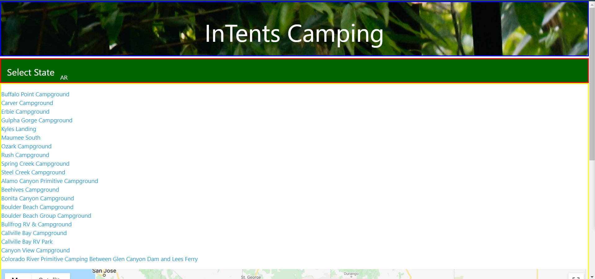

# Group Project - InTentsCamping

Layout/Front End - Shawn McWhorter
API research and connection - Chris O'Conner
Back end/Local Storage - Josh Rist

## User Story

As a camper
I want to find a list of campsites in a state of my chosing
So that I can rout my trip through my chosen state.

### Project Description
From the Select State, choose the state you wish to explore
A list of campgrounds in the state will populate, with the name and website

### Technologies
Front End
    Materialize was used as we did not need a robust library such as Foundation. The simplified Materialize would be easier to apply the simple structure.

Back End
    JQuery - To lessen the code needed to run the project
    NPS.org - This API is used to find the campgrounds in the state and return the website. 
    Google Maps API - Used to add markers to the map for the campground locations

#### Challenges
We choose two very robust API's and from the many searches we tried for debugging and API connection, we discovered we are among a very small number of programmers who have attempted something like this. There are other applications that will find websites but no one was using the API's in the manner we were attempting.

One of the major problems we faced was feeding the data returned from the state selection into the query area of Google Maps.

Other challenges included getting the localStorage function to hold the information we wanted, using Materialize for more complex containers. Some of these containers did not work and were created with vanilla HTML. Also Materialize is a bit harder to add dynamically.

##### Links and Images
https://github.com/OConnor-Chris/InTentsCamping

https://oconnor-chris.github.io/InTentsCamping/

